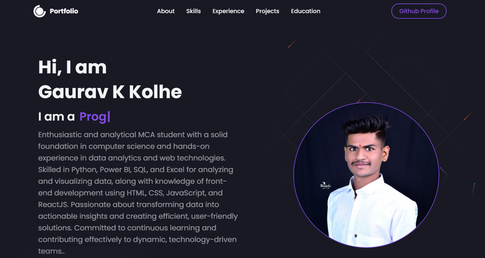

<!-- 🌐 Gaurav Kolhe — Premium Portfolio README -->
<!-- SEO Optimized Metadata -->
<meta name="title" content="Gaurav Kolhe — React Developer Portfolio">
<meta name="description" content="A modern developer portfolio built using React, Bootstrap, and custom UI design. Showcasing projects, skills, and professional experience. Deployed on Netlify.">
<meta name="keywords" content="Gaurav Kolhe, Portfolio, React Developer, Frontend Developer, JavaScript Developer, Bootstrap, Netlify, Web Development">
<meta name="author" content="Gaurav Kolhe">

<h1 align="center">🌐 Gaurav Kolhe — Developer Portfolio</h1>

A modern, performance-optimized React portfolio deployed on Netlify. Built with clean UI principles, scalable components, and a strong focus on responsiveness and professional presentation.

---

## 🏷️ Tech Badges  

  
  
  
  
  

---

## 🔗 Live Website  
**🌍 https://gauravkolhe.netlify.app/**  
Hosted on **Netlify Edge** with automatic deployments.

---

## ✨ Portfolio Purpose  
This portfolio represents my professional identity as a developer, combining elegant aesthetics with performant code. Built with React & Bootstrap components, every section reflects a design-first, developer-focused mindset with:  
- ⚡ fast loading  
- 📱 full responsiveness  
- 🧩 modular architecture  
- 🎨 a clean and premium UI feel  

---

## ⚛️ Tech Stack  
- **React.js** — component-based architecture  
- **Bootstrap 5** — responsive UI utilities  
- **CSS3** — custom styling & animations  
- **JavaScript (ES6+)**  
- **Netlify** — deployment & hosting  

---

## 🚀 Key Features  
- Modular React components  
- Modern & minimal UI  
- Mobile-first responsive layout  
- Smooth transitions & interactions  
- Organized project showcase  
- Instant global delivery via Netlify CDN  
- SEO-ready metadata (included above)  

---

## 🖼️ UI Preview  
*(Place real screenshots in `/screenshots`)*  

  
    
  
      
  
      
  

---
